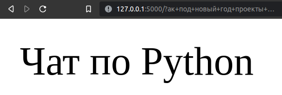
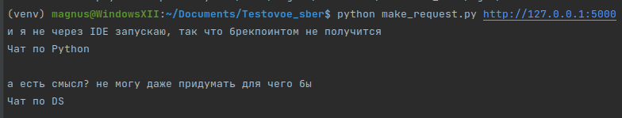

# Классификация сообщений
Для запуска решения нужно установить зависимости из `requirements.txt` и запустить: 
``` terminal
python app.py
```
далее нужно отправить сообщение, заменяя пробельные символы "+"  
  
Так же можно воспользоватся скриптом
``` terminal
python make_request.py <url по которому запустилось приложение>
```
Далее можно слать сколько угодно сообщений


Все эксперименты находятся в `solution.ipynb`
